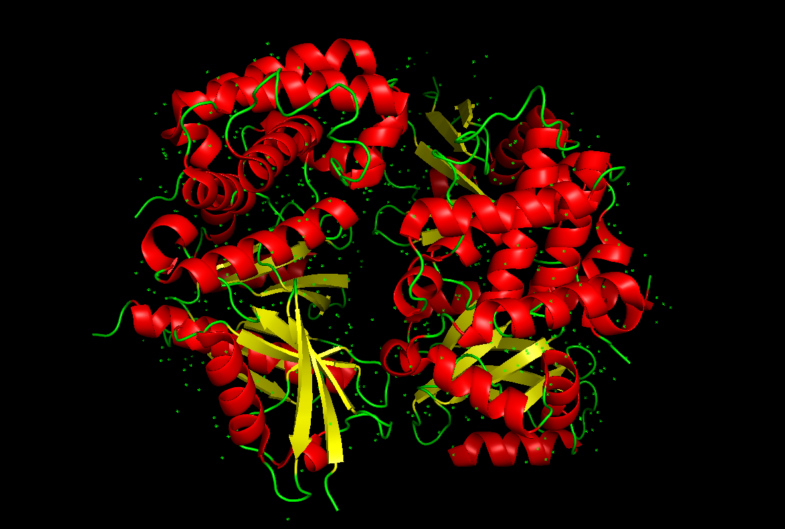
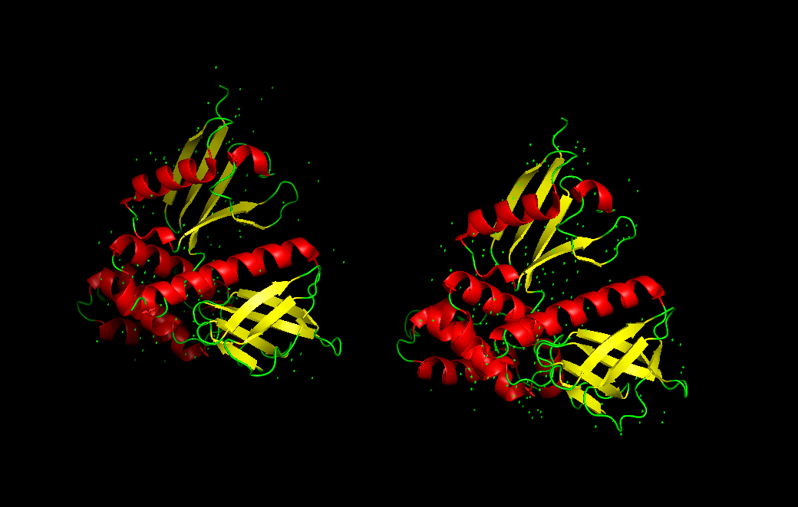

# Ezrin（EZR，P15311）蛋白结构 Wiki

## 1. 概述
【在这里写一段简介：
Ezrin 是 ERM 蛋白家族（Ezrin‑Radixin‑Moesin）的重要成员，主要功能是连接细胞膜与肌动蛋白细胞骨架，参与细胞形态维持、细胞迁移、信号传导等过程。】

## 2. Ezrin 的两种构象状态
Ezrin 主要以两种状态存在：**闭合态（休眠态）** 和 **开放态（激活态）**，构象变化是其功能的核心。

### 2.1 闭合态（休眠态）PDB: 4RM8
【在这里写休眠态的特点：
休眠态下，Ezrin 的 N 端与 C 端发生分子内相互作用，形成紧凑结构，处于自抑制状态，无法结合膜与骨架。】

### 2.2 开放态（激活态）PDB: 1NI2
【在这里写激活态的特点：
当 Ezrin 被磷酸化后，自抑制解除，构象打开，N 端结合细胞膜，C 端结合肌动蛋白，成为功能激活状态。】

## 3. 生物学功能
- 维持细胞形态与极性
- 调控细胞黏附与迁移
- 参与细胞信号传导通路
- 连接膜蛋白与细胞骨架

## 4. 参考文献
1. 【在这里写第一条参考文献】
2. 【在这里写第二条参考文献】
3. 【在这里写第三条参考文献】
